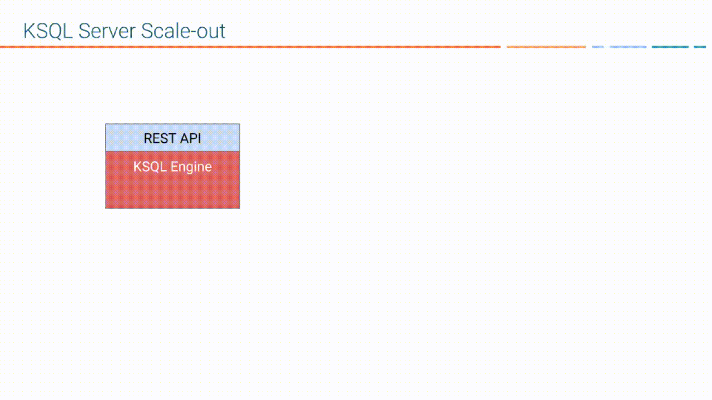
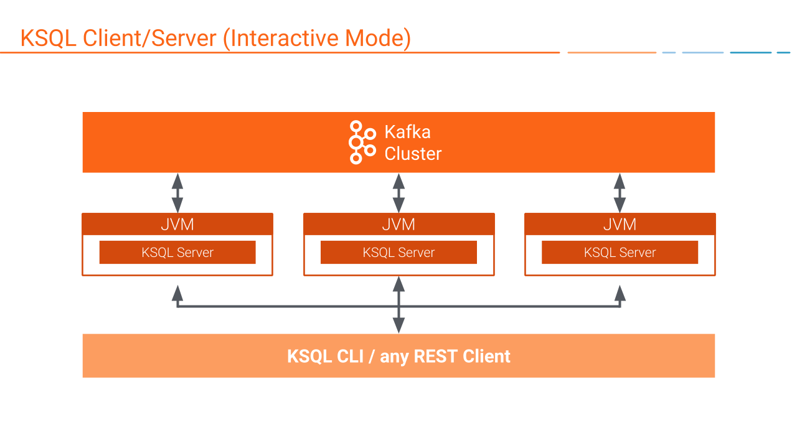
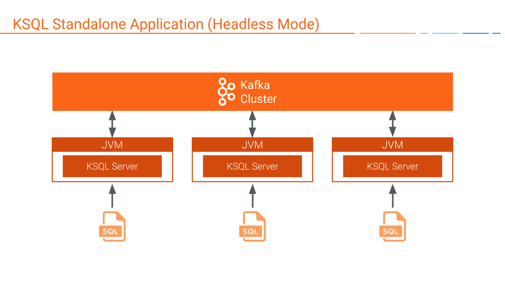
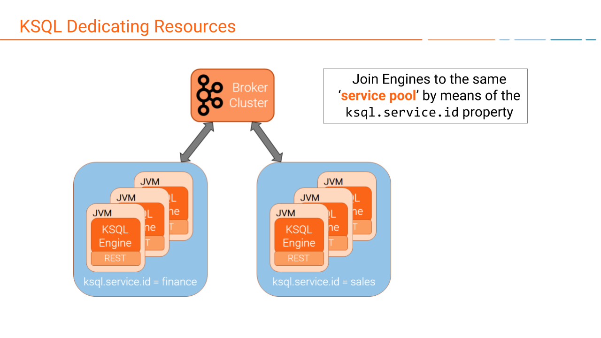
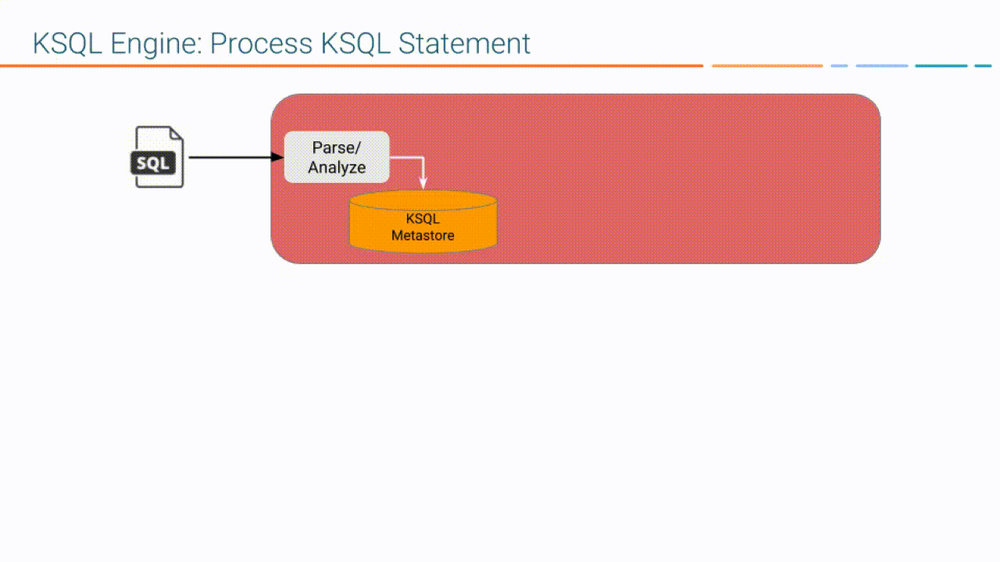
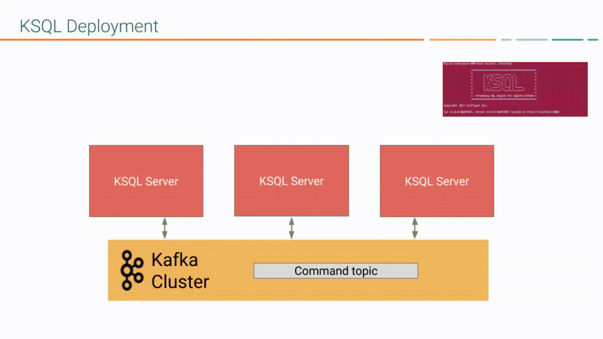
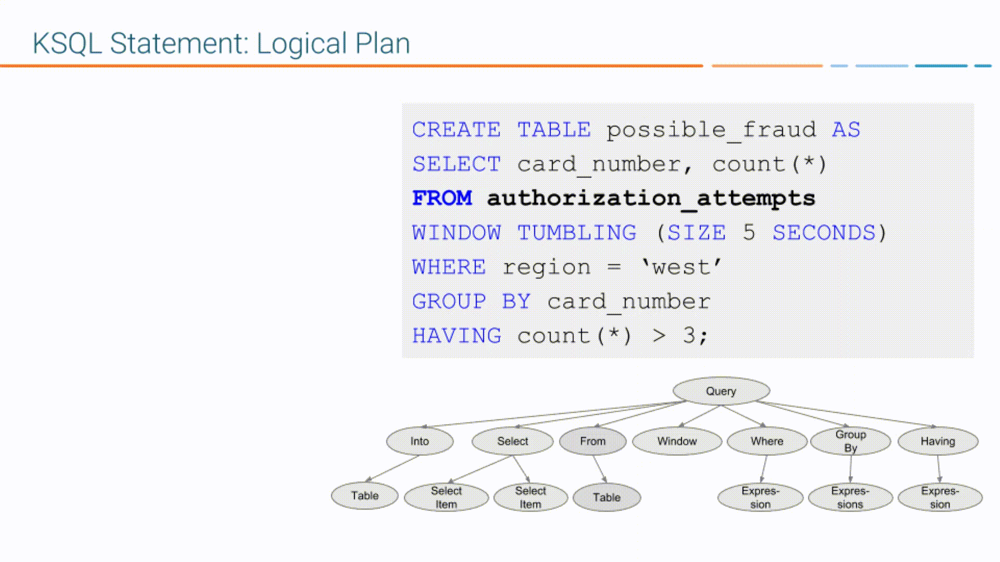
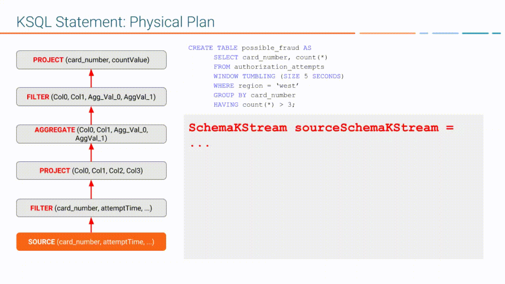

---
---
KSQL Architecture
=================

You can use KSQL to build event streaming applications from {{
site.ak-tm }} topics by using only SQL statements and queries. KSQL is
built on Kafka Streams, so a KSQL application communicates with a Kafka
cluster like any other Kafka Streams application.

KSQL Components
---------------

KSQL has these main components:

-   KSQL engine -- processes KSQL statements and queries
-   REST interface -- enables client access to the engine
-   KSQL CLI -- console that provides a command-line interface (CLI) to
    the engine
-   KSQL UI -- enables developing KSQL applications in {{ site.c3 }}

KSQL Server comprises the KSQL engine and the REST API. KSQL Server
instances communicate with the Kafka cluster, and you can add more of
them as necessary without restarting your applications.

{.align-center}

KSQL Engine

:   The KSQL engine executes KSQL statements and queries. You define
    your application logic by writing KSQL statements, and the engine
    builds and runs the application on available KSQL servers. Each KSQL
    server instance runs a KSQL engine. Under the hood, the engine
    parses your KSQL statements and builds corresponding Kafka Streams
    topologies.

    The KSQL engine is implemented in the
    [KsqlEngine.java](https://github.com/confluentinc/ksql/blob/master/ksql-engine/src/main/java/io/confluent/ksql/KsqlEngine.java)
    class.

KSQL CLI

:   The KSQL CLI provides a console with a command-line interface for
    the KSQL engine. Use the KSQL CLI to interact with KSQL Server
    instances and develop your streaming applications. The KSQL CLI is
    designed to be familiar to users of MySQL, Postgres, and similar
    applications.

    The KSQL CLI is implemented in the
    [io.confluent.ksql.cli](https://github.com/confluentinc/ksql/tree/master/ksql-cli/src/main/java/io/confluent/ksql/cli)
    package.

REST Interface

:   The REST server interface enables communicating with the KSQL engine
    from the CLI, {{ site.c3 }}, or from any other REST client. For more
    information, see [ksql-rest-api]{role="ref"}.

    The KSQL REST server is implemented in the
    [KsqlRestApplication.java](https://github.com/confluentinc/ksql/blob/master/ksql-rest-app/src/main/java/io/confluent/ksql/rest/server/KsqlRestApplication.java)
    class.

When you deploy your KSQL application, it runs on KSQL Server instances
that are independent of one another, are fault-tolerant, and can scale
elastically with load. For more information, see
[ksql-deployment-modes]{role="ref"}.

{.align-center}

KSQL and Kafka Streams
----------------------

KSQL is built on Kafka Streams, a robust stream processing framework
that is part of Apache Kafka. You can use KSQL and Kafka Streams
together in your event streaming applications. For more information on
their relationship, see [ksql-and-kafka-streams]{role="ref"}. For more
information on Kafka Streams, see [Streams
Architecture](https://docs.confluent.io/current/streams/architecture.html).

Also, you can implement custom logic and aggregations in your KSQL
applications by implementing User Defined Functions in Java. For more
information, see [ksql-udfs]{role="ref"}.

KSQL Language Elements
----------------------

Like traditional relational databases, KSQL supports two categories of
statements: Data Definition Language (DDL) and Data Manipulation
Language (DML).

These categories are similar in syntax, data types, and expressions, but
they have different functions in KSQL Server.

Data Definition Language (DDL) Statements

:   Imperative verbs that define metadata on the KSQL server by adding,
    changing, or deleting streams and tables. Data Definition Language
    statements modify metadata only and don\'t operate on data. You can
    use these statements with declarative DML statements.

    The DDL statements include:

    -   CREATE STREAM
    -   CREATE TABLE
    -   DROP STREAM
    -   DROP TABLE
    -   CREATE STREAM AS SELECT (CSAS)
    -   CREATE TABLE AS SELECT (CTAS)

Data Manipulation Language (DML) Statements

:   Declarative verbs that read and modify data in KSQL streams and
    tables. Data Manipulation Language statements modify data only and
    don\'t change metadata. The KSQL engine compiles DML statements into
    Kafka Streams applications, which run on a Kafka cluster like any
    other Kafka Streams application.

    The DML statements include:

    -   SELECT
    -   INSERT INTO
    -   CREATE STREAM AS SELECT (CSAS)
    -   CREATE TABLE AS SELECT (CTAS)

The CSAS and CTAS statements occupy both categories, because they
perform both a metadata change, like adding a stream, and they
manipulate data, by creating a derivative of existing records.

For more information, see [ksql\_syntax\_reference]{role="ref"}.

KSQL Deployment Modes
---------------------

You can use these modes to deploy your KSQL streaming applications:

-   Interactive -- data exploration and pipeline development
-   Headless -- long-running production environments

In both deployment modes, KSQL enables distributing the processing load
for your KSQL applications across all KSQL Server instances, and you can
add more KSQL Server instances without restarting your applications.

::: {.note}
::: {.admonition-title}
Note
:::

All servers that run in a cluster must use the same deployment mode.
:::

### Interactive Deployment

Use the interactive mode to develop your KSQL applications. When you
deploy a KSQL server in interactive mode, the REST interface is
available for the KSQL CLI and {{ site.c3 }} to connect to.

{.align-center}

In interactive mode, you can:

-   Write statements and queries on the fly
-   Start any number of server nodes:
    `<path-to-confluent>/bin/ksql-server-start`
-   Start one or more CLIs or REST Clients and point them to a server:
    `<path-to-confluent>/bin/ksql https://<ksql-server-ip-address>:8090`

#### Command Topic

In interactive mode, KSQL shares statements with servers in the cluster
over the *command topic*. The command topic stores every KSQL statement,
along with some metadata that ensures the statements are built
compatibly across KSQL restarts and upgrades. KSQL names the command
topic `_confluent-ksql-<service id>command_topic`, where `<service id>`
is the value in the `ksql.service.id` property.

By convention, the `ksql.service.id` property should end with a
separator character of some form, for example a dash or underscore, as
this makes the topic name easier to read.

### Headless Deployment {#ksql-server-headless-deployment}

Use headless mode to deploy your KSQL application to a production
environment. When you deploy a KSQL server in headless mode, the REST
interface isn\'t available, so you assign workloads to KSQL servers by
using a SQL file. The SQL file contains the KSQL statements and queries
that define your application. Headless mode is ideal for streaming ETL
application deployments.

{.align-center}

In headless mode you can:

-   Start any number of server nodes
-   Pass a SQL file with KSQL statements to execute:
    `<path-to-confluent>bin/ksql-node query-file=path/to/myquery.sql`
-   Version-control your queries and transformations as code
-   Ensure resource isolation
-   Leave resource management to dedicated systems, like Kubernetes

::: {.note}
::: {.admonition-title}
Note
:::

Headless mode deployments don\'t have a command topic.
:::

#### Config Topic {#ksql-architecture-config-topic}

In headless mode, you supply KSQL statements to each server in its SQL
file. However KSQL still needs to store some internal metadata to ensure
that it builds queries compatibly across restarts and upgrades. KSQL
stores this metadata in an internal topic called the *config topic*.
KSQL names the config topic `_confluent-ksql-<service id>_configs`,
where `<service id>` is the value in the `ksql.service.id` property.

### Supported Operations in Headless and Interactive Modes

The following table shows which KSQL operations are supported in
headless and interactive deployments.

  -----------------------------------------------------------------------
  KSQL Operation                          Interactive    Headless KSQL
                                          KSQL           
  --------------------------------------- -------------- ----------------
  Describe a stream or table, including   Supported      Not Supported
  runtime stats (DESCRIBE, DESCRIBE                      
  EXTENDED)                                              

  Explain a query, including runtime      Supported      Not Supported
  stats (EXPLAIN)                                        

  CREATE a stream or table                Supported      Supported

  DROP a stream or table                  Supported      Not Supported

  List existing streams and tables (SHOW  Supported      Not Supported
  STREAMS, SHOW TABLES)                                  

  List running queries (SHOW QUERIES)     Supported      Not Supported

  Run a script (RUN SCRIPT)               Supported      Not Supported

  Set query properties (SET)              Supported      Supported

  Show contents of a Kafka topic (PRINT)  Supported      Not Supported

  Show contents of a stream or table      Supported      Not Supported
  (SELECT)                                               

  Show properties of a query (SHOW        Supported      Not Supported
  PROPERTIES)                                            

  Show results of a query (SELECT)        Supported      Not Supported

  TERMINATE a query                       Supported      Not Supported

  Start and stop a KSQL Server instance   Not with KSQL  Not with KSQL
                                          API            API

  Cleanup and delete internal data        Supported      Not with KSQL
  (internal topics) of a KSQL cluster or  (KSQL REST     API
  application                             API)           
  -----------------------------------------------------------------------

::: {.note}
::: {.admonition-title}
Note
:::

You can perform operations listed as \"Not with KSQL API\" manually.
Also, you can use deployment tools, like Kubernetes or Ansible, and you
can use the Kafka tools, like `kafka-delete-records`.
:::

Dedicating Resources
--------------------

Join KSQL engines to the same *service pool* by using the
`ksql.service.id` property. The following diagram shows a Kafka cluster
with separate workloads for a `finance` pool and a `sales` pool. For
more information, see [ksql-service-id]{role="ref"}.

{.align-center}

To scale out, just add more KSQL server instances. There\'s no master
node or coordination among them required. For more information, see
[ksql\_capacity\_planning]{role="ref"}.

KSQL Query Lifecycle
--------------------

To create a streaming application with KSQL, you write KSQL statements
and queries. Each statement and query has a lifecycle with the following
steps:

1.  You
    [register a KSQL stream or table \<ksql-query-lifecycle-register-stream\>]{role="ref"}
    from an existing Kafka topic with a DDL statement, like
    `CREATE STREAM <my-stream> WITH <topic-name>`.
2.  You
    [express your app \<ksql-query-lifecycle-express-app\>]{role="ref"}
    by using a KSQL statement, like
    `CREATE TABLE AS SELECT FROM <my-stream>`.
3.  KSQL
    [parses your statement \<ksql-query-lifecycle-parse-statement\>]{role="ref"}
    into an abstract syntax tree (AST).
4.  KSQL uses the AST and
    [creates the logical plan \<ksql-query-lifecycle-logical-plan\>]{role="ref"}
    for your statement.
5.  KSQL uses the logical plan and
    [creates the physical plan \<ksql-query-lifecycle-physical-plan\>]{role="ref"}
    for your statement.
6.  KSQL generates and runs the Kafka Streams application.
7.  You manage the application as a STREAM or TABLE with its
    corresponding persistent query.

{.align-center}

### Register the Stream {#ksql-query-lifecycle-register-stream}

Register a stream or table by using the DDL statements, CREATE STREAM
and CREATE TABLE. For example, the following KSQL statement creates a
stream named `authorization_attempts` that\'s backed by a topic named
`authorizations`.

``` {.sourceCode .sql}
CREATE STREAM authorization_attempts
  (card_number VARCHAR, attemptTime BIGINT, ...)
  WITH (kafka_topic='authorizations', value_format=‘JSON’); 
```

KSQL writes DDL and DML statements to the *command topic*. Each KSQL
Server reads the statement from the command topic, parsing and analyzing
it.

{.align-center}

The CREATE STREAM statement is a DDL statement, so the action is to
update the KSQL metadata.

Each KSQL server has an internal, in-memory metadata store, or
*metastore*, that it builds as it receives DDL statements. The metastore
is an in-memory map. For each new DDL statement, the KSQL engine adds an
entry to the metastore.

For example, the metastore entry for the previous CREATE STREAM
statement might resemble:

  --------------------------------------------------------------------------------
  Source Name               Structured Data Source
  ------------------------- ------------------------------------------------------
  AUTHORIZATION\_ATTEMPTS   \[DataSourceType: STREAM\], \[Schema:(card\_number
                            VARCHAR, attemptTime BIGINT, attemptRegion VARCHAR,
                            \...)\], \[Key: null\], \[KsqlTopic: AUTHORIZATIONS\],
                            \...

  --------------------------------------------------------------------------------

The KSQL metastore is implemented in the
[io.confluent.ksql.metastore](https://github.com/confluentinc/ksql/tree/master/ksql-metastore/src/main/java/io/confluent/ksql/metastore)
package.

### Express Your Application as a KSQL Statement {#ksql-query-lifecycle-express-app}

Now that you have a stream, express your application\'s business logic
by using a KSQL statement. The following DML statement creates a
`possible_fraud` table from the `authorization_attempts` stream:

``` {.sourceCode .sql}
CREATE TABLE possible_fraud AS
  SELECT card_number, count(*)
  FROM authorization_attempts
  WINDOW TUMBLING (SIZE 5 SECONDS)
  WHERE region = ‘west’
  GROUP BY card_number
  HAVING count(*) > 3; 
```

The KSQL engine translates the DML statement into a Kafka Streams
application. The application reads the source topic continuously, and
whenever the `count(*) > 3` condition is met, it writes records to the
`possible_fraud` table.

### KSQL Parses Your Statement {#ksql-query-lifecycle-parse-statement}

To express your DML statement as a Kafka Streams application, the KSQL
engine starts by parsing the statement. The parser creates an abstract
syntax tree (AST). The KSQL engine uses the AST to plan the query.

The KSQL statement parser is based on [ANTLR](https://www.antlr.org/)
and is implemented in the
[io.confluent.ksql.parser](https://github.com/confluentinc/ksql/tree/master/ksql-parser/src/main)
package.

### KSQL Creates the Logical Plan {#ksql-query-lifecycle-logical-plan}

The KSQL engine creates the logical plan for the query by using the AST.
For the previous `possible_fraud` statement, the logical plan has the
following steps:

1.  Define the source -- FROM node
2.  Apply the filter -- WHERE clause
3.  Apply aggregation -- GROUP BY
4.  Project -- WINDOW
5.  Apply post-aggregation filter -- HAVING, applied to the result of
    GROUP BY
6.  Project -- for the result

{.align-center}

### KSQL Creates the Physical Plan {#ksql-query-lifecycle-physical-plan}

From the logical plan, the KSQL engine creates the physical plan, which
is a Kafka Streams DSL application with a schema.

The generated code is based on the KSQL classes, `SchemaKStream` and
`SchemaKTable`:

-   A KSQL stream is rendered as a
    [SchemaKStream](https://github.com/confluentinc/ksql/blob/master/ksql-engine/src/main/java/io/confluent/ksql/structured/SchemaKStream.java)
    instance, which is a
    [KStream](https://docs.confluent.io/current/streams/javadocs/org/apache/kafka/streams/kstream/KStream.html)
    with a
    [Schema](https://kafka.apache.org/20/javadoc/org/apache/kafka/connect/data/Schema.html).
-   A KSQL table is rendered as a
    [SchemaKTable](https://github.com/confluentinc/ksql/blob/master/ksql-engine/src/main/java/io/confluent/ksql/structured/SchemaKTable.java)
    instance, which is a
    [KTable](https://docs.confluent.io/current/streams/javadocs/org/apache/kafka/streams/kstream/KTable.html)
    with a
    [Schema](https://kafka.apache.org/20/javadoc/org/apache/kafka/connect/data/Schema.html).
-   Schema awareness is provided by the
    [SchemaRegistryClient](https://github.com/confluentinc/schema-registry/blob/master/client/src/main/java/io/confluent/kafka/schemaregistry/client/SchemaRegistryClient.java)
    class.

The KSQL engine traverses the nodes of the logical plan and emits
corresponding Kafka Streams API calls:

1.  Define the source -- a `SchemaKStream` or `SchemaKTable` with info
    from the KSQL metastore
2.  Filter -- produces another `SchemaKStream`
3.  Project -- `select()` method
4.  Apply aggregation -- Multiple steps: `rekey()`, `groupby()`, and
    `aggregate()` methods. KSQL may re-partition data if it\'s not keyed
    with a GROUP BY phrase.
5.  Filter -- `filter()` method
6.  Project -- `select()` method for the result

{.align-center}

If the DML statement is CREATE STREAM AS SELECT or CREATE TABLE AS
SELECT, the result from the generated Kafka Streams application is a
persistent query that writes continuously to its output topic until the
query is terminated.
