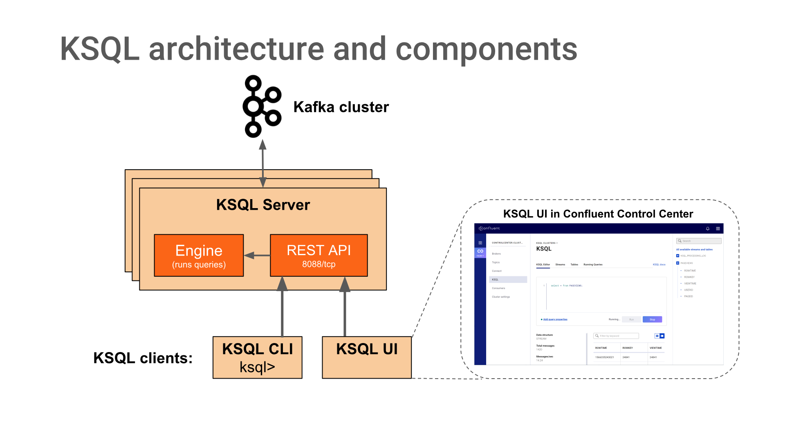

---
---
KSQL {#ksql_home}
====

What Is KSQL?
-------------

KSQL is the streaming SQL engine for {{ site.ak-tm }}. It provides an
easy-to-use yet powerful interactive SQL interface for stream processing
on Kafka, without the need to write code in a programming language such
as Java or Python. KSQL is scalable, elastic, fault-tolerant, and
real-time. It supports a wide range of streaming operations, including
data filtering, transformations, aggregations, joins, windowing, and
sessionization.

Learn More

:   Watch the [screencast of the KSQL
    demo](https://www.youtube.com/embed/illEpCOcCVg) on YouTube.

    

        <iframe src="https://www.youtube.com/embed/illEpCOcCVg" frameborder="0" allowfullscreen style="position: absolute; top: 0; left: 0; width: 100%; height: 100%;"></iframe>
    

What Can I Do With KSQL?
------------------------

Streaming ETL

:   Apache Kafka is a popular choice for powering data pipelines. KSQL
    makes it simple to transform data within the pipeline, readying
    messages to cleanly land in another system.

Real-time Monitoring and Analytics

:   Track, understand, and manage infrastructure, applications, and data
    feeds by quickly building real-time dashboards, generating metrics,
    and creating custom alerts and messages.

Data exploration and discovery

:   Navigate and browse through your data in Kafka.

Anomaly detection

:   Identify patterns and spot anomalies in real-time data with
    millisecond latency, allowing you to properly surface out of the
    ordinary events and to handle fraudulent activities separately.

Personalization

:   Create data driven real-time experiences and insight for users.

Sensor data and IoT

:   Understand and deliver sensor data how and where it needs to be.

Customer 360-view

:   Achieve a comprehensive understanding of your customers across every
    interaction through a variety of channels, where new information is
    continuously incorporated in real-time.

What Are the Components?
------------------------

{.align-center
width="13.33333in" height="7.5in"}

KSQL Server

:   The KSQL server runs the engine that executes KSQL queries. This
    includes processing, reading, and writing data to and from the
    target Kafka cluster.

    KSQL servers form KSQL clusters and can run in containers, virtual
    machines, and bare-metal machines. You can add and remove servers
    to/from the same KSQL cluster during live operations to elastically
    scale KSQL\'s processing capacity as desired. You can deploy
    different KSQL clusters to achieve workload isolation.

KSQL CLI

:   You can interactively write KSQL queries by using the KSQL command
    line interface (CLI). The KSQL CLI acts as a client to the KSQL
    server. For production scenarios you may also configure KSQL servers
    to run in non-interactive \"headless\" configuration, thereby
    preventing KSQL CLI access.

KSQL servers, clients, queries, and applications run outside of Kafka
brokers, in separate JVM instances, or in separate clusters entirely.

KSQL Resources
--------------

-   The [Stream Processing
    Cookbook](https://www.confluent.io/product/ksql/stream-processing-cookbook)
    contains KSQL recipes that provide in-depth tutorials and
    recommended deployment scenarios.
-   Check out [ksql\_tutorials]{role="ref"} to learn about stream
    processing with KSQL.
-   Watch the [screencast of What Can I Do With
    KSQL?](https://www.youtube.com/embed/euz0isNG1SQ) on YouTube.

Supported Versions and Interoperability
---------------------------------------

::: {#ksql-supported-versions}
You can use KSQL with compatible {{ site.cp }} and {{ site.ak-tm }}
versions.

+-----------------------+--------------------+
| KSQL version          | {{ site.version }} |
+=======================+====================+
| Apache Kafka version  | 0.11.0 and later   |
+-----------------------+--------------------+
| {{ site.cp }} version | > 3.3.0 and later  |
+-----------------------+--------------------+
:::

KSQL Documentation
------------------

::: {.toctree}
quickstart installation/index concepts/index developer-guide/index
operations capacity-planning tutorials/index faq changelog
troubleshoot-ksql
:::
