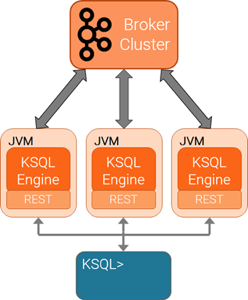

---
---
Installing KSQL[]{#ksql_supported_versions} {#install_overview}
===========================================

KSQL is a component of {{ site.cp }} and the KSQL binaries are located
at
[<https://www.confluent.io/download/>](https://www.confluent.io/download/)
as a part of the {{ site.cp }} bundle.

KSQL must have access to a running {{ site.ak-tm }} cluster, which can
be in your data center, in a public cloud, {{ site.ccloud }}, etc.

Docker support

:   You can deploy KSQL by using
    [Docker containers \<install-ksql-with-docker\>]{role="ref"}.
    Starting with {{ site.cp }} 4.1.2, Confluent maintains images at
    [Docker Hub](https://hub.docker.com/r/confluentinc/cp-ksql-server/).
    To start KSQL containers in configurations like \"KSQL Headless
    Server\" and \"Interactive Server with Interceptors\", see
    [Docker Configuration Parameters \<config\_reference\>]{role="ref"}.

Watch the [screencast of Installing and Running
KSQL](https://www.youtube.com/embed/icwHpPm-TCA) on YouTube.

Supported Versions and Interoperability
---------------------------------------

Installation Instructions {#install_ksql-server}
-------------------------

Follow the instructions at [ce-quickstart]{role="ref"}.

Also, you can install KSQL individually by using the
[confluent-ksql package \<confluent-ksql-package\>]{role="ref"}. For
more information, see [available\_packages]{role="ref"}.

Scale Your KSQL Server Deployment
---------------------------------

You can scale KSQL by adding more capacity per server (vertically) or by
adding more servers (horizontally). Also, you can scale KSQL clusters
during live operations without loss of data. For more information, see
[ksql-capacity-planning-scaling]{role="ref"}.

Starting the KSQL Server {#start_ksql-server}
------------------------

The KSQL servers are run separately from the KSQL CLI client and Kafka
brokers. You can deploy servers on remote machines, VMs, or containers
and then the CLI connects to these remote servers.

You can add or remove servers from the same resource pool during live
operations, to elastically scale query processing. You can use different
resource pools to support workload isolation. For example, you could
deploy separate pools for production and for testing.

You can only connect to one KSQL server at a time. The KSQL CLI does not
support automatic failover to another KSQL server.

{.align-center}

Follow these instructions to start KSQL server using the
`ksql-server-start` script.

1.  Specify your KSQL server configuration parameters. You can also set
    any property for the Kafka Streams API, the Kafka producer, or the
    Kafka consumer. The required parameters are `bootstrap.servers` and
    `listeners`. You can specify the parameters in the KSQL properties
    file or the `KSQL_OPTS` environment variable. Properties set with
    `KSQL_OPTS` take precedence over those specified in the properties
    file.

    A recommended approach is to configure a common set of properties
    using the KSQL configuration file and override specific properties
    as needed, using the `KSQL_OPTS` environment variable.

    Here are the default settings:

        bootstrap.servers=localhost:9092
        listeners=http://0.0.0.0:8088

    For more information, see [ksql-server-config]{role="ref"}.

2.  Start a server node with this command:

    ``` {.sourceCode .bash}
    $ <path-to-confluent>/bin/ksql-server-start <path-to-confluent>/etc/ksql/ksql-server.properties
    ```

    ::: {.tip}
    ::: {.admonition-title}
    Tip
    :::

    You can view the KSQL server help text by running
    `<path-to-confluent>/bin/ksql-server-start --help`.

        NAME
                server - KSQL Cluster

        SYNOPSIS
                server [ {-h | --help} ] [ --queries-file <queriesFile> ] [--]
                        <config-file>

        OPTIONS
                -h, --help
                    Display help information

                --queries-file <queriesFile>
                    Path to the query file on the local machine.

                --
                    This option can be used to separate command-line options from the
                    list of arguments (useful when arguments might be mistaken for
                    command-line options)

                <config-file>
                    A file specifying configs for the KSQL Server, KSQL, and its
                    underlying Kafka Streams instance(s). Refer to KSQL documentation
                    for a list of available configs.

                    This option may occur a maximum of 1 times
    :::

3.  Have a look at [this page \<restrict-ksql-interactive\>]{role="ref"}
    for instructions on running KSQL in non-interactive (aka headless)
    mode.

Starting the KSQL CLI {#install_ksql-cli}
---------------------

The KSQL CLI is a client that connects to the KSQL servers.

You can start the KSQL CLI by providing the connection information to
the KSQL server.

``` {.sourceCode .bash}
$ LOG_DIR=./ksql_logs <path-to-confluent>/bin/ksql http://localhost:8088
```

After KSQL is started, your terminal should resemble this.

::: {.tip}
::: {.admonition-title}
Tip
:::

You can view the KSQL CLI help text by running
`<path-to-confluent>/bin/ksql --help`.

    NAME
            ksql - KSQL CLI

    SYNOPSIS
            ksql [ --config-file <configFile> ] [ {-h | --help} ]
                    [ --output <outputFormat> ]
                    [ --query-row-limit <streamedQueryRowLimit> ]
                    [ --query-timeout <streamedQueryTimeoutMs> ] [--] <server>

    OPTIONS
            --config-file <configFile>
                A file specifying configs for Ksql and its underlying Kafka Streams
                instance(s). Refer to KSQL documentation for a list of available
                configs.

            -h, --help
                Display help information

            --output <outputFormat>
                The output format to use (either 'JSON' or 'TABULAR'; can be changed
                during REPL as well; defaults to TABULAR)

            --query-row-limit <streamedQueryRowLimit>
                An optional maximum number of rows to read from streamed queries

                This options value must fall in the following range: value >= 1


            --query-timeout <streamedQueryTimeoutMs>
                An optional time limit (in milliseconds) for streamed queries

                This options value must fall in the following range: value >= 1


            --
                This option can be used to separate command-line options from the
                list of arguments (useful when arguments might be mistaken for
                command-line options)

            <server>
                The address of the Ksql server to connect to (ex:
                http://confluent.io:9098)

                This option may occur a maximum of 1 times
:::

\-\-\-\-\-\-\-\-\-\-\-\-\-\-\-\-\-\-\-\-\-\-\-\-\-\-\-\--Configuring
KSQL for {{ site.ccloud }}
\-\-\-\-\-\-\-\-\-\-\-\-\-\-\-\-\-\-\-\-\-\-\-\-\-\-\-\--

You can use KSQL with a Kafka cluster in {{ site.ccloud }}. For more
information, see [install\_ksql-ccloud]{role="ref"}.
